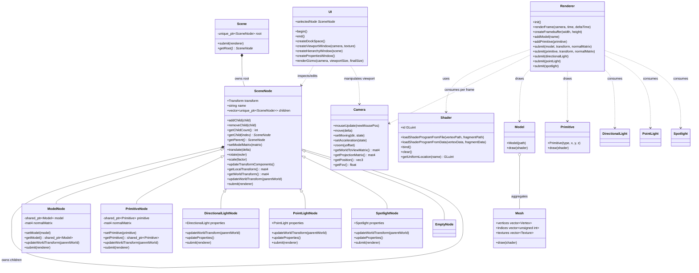

# UML Diagram

This UML class diagram captures the key runtime architecture of the renderer (scene graph, render pipeline, geometry, camera, and UI).

```mermaid
classDiagram
    class Renderer {
      +init()
      +renderFrame(camera, time, deltaTime)
      +createFramebuffer(width, height)
      +addModel(name)
      +addPrimitive(primitive)
      +submit(model, transform, normalMatrix)
      +submit(primitive, transform, normalMatrix)
      +submit(directionalLight)
      +submit(pointLight)
      +submit(spotlight)
    }

    class Scene {
      -unique_ptr~SceneNode~ root
      +submit(renderer)
      +getRoot() SceneNode*
    }

    class SceneNode {
      +Transform transform
      +string name
      +vector~unique_ptr~SceneNode~~ children
      +addChild(child)
      +removeChild(child)
      +getChildCount() int
      +getChild(index) SceneNode*
      +getParent() SceneNode*
      +setModelMatrix(matrix)
      +translate(delta)
      +rotate(euler)
      +scale(factor)
      +updateTransformComponents()
      +getLocalTransform() mat4
      +getWorldTransform() mat4
      +updateWorldTransform(parentWorld)
      +submit(renderer)
    }

    class ModelNode {
      -shared_ptr~Model~ model
      -mat4 normalMatrix
      +setModel(model)
      +getModel() shared_ptr~Model~
      +updateWorldTransform(parentWorld)
      +submit(renderer)
    }

    class PrimitiveNode {
      -shared_ptr~Primitive~ primitive
      -mat4 normalMatrix
      +setPrimitive(primitive)
      +getPrimitive() shared_ptr~Primitive~
      +updateWorldTransform(parentWorld)
      +submit(renderer)
    }

    class DirectionalLightNode {
      +DirectionalLight properties
      +updateWorldTransform(parentWorld)
      +updateProperties()
      +submit(renderer)
    }

    class PointLightNode {
      +PointLight properties
      +updateWorldTransform(parentWorld)
      +updateProperties()
      +submit(renderer)
    }

    class SpotlightNode {
      +Spotlight properties
      +updateWorldTransform(parentWorld)
      +updateProperties()
      +submit(renderer)
    }

    class EmptyNode

    class Camera {
      +mouseUpdate(newMousePos)
      +move(delta)
      +setMoving(dir, state)
      +setAcceleration(state)
      +zoom(yoffset)
      +getWorldToViewMatrix() mat4
      +getProjectionMatrix() mat4
      +getPosition() vec3
      +getFov() float
    }

    class Shader {
      +id GLuint
      +loadShaderProgramFromFile(vertexPath, fragmentPath)
      +loadShaderProgramFromData(vertexData, fragmentData)
      +bind()
      +clear()
      +getUniformLocation(name) GLuint
    }

    class Model {
      +Model(path)
      +draw(shader)
    }

    class Mesh {
      +vertices vector~Vertex~
      +indices vector~unsigned int~
      +textures vector~Texture~
      +draw(shader)
    }

    class Primitive {
      +Primitive(type, x, y, z)
      +draw(shader)
    }

    class UI {
      +selectedNode SceneNode*
      +begin()
      +end()
      +createDockSpace()
      +createViewportWindow(camera, texture)
      +createHierarchyWindow(scene)
      +createPropertiesWindow()
      +renderGizmo(camera, viewportSize, finalSize)
    }

    class DirectionalLight
    class PointLight
    class Spotlight

    Scene *-- SceneNode : owns root
    SceneNode *-- SceneNode : owns children

    SceneNode <|-- ModelNode
    SceneNode <|-- PrimitiveNode
    SceneNode <|-- DirectionalLightNode
    SceneNode <|-- PointLightNode
    SceneNode <|-- SpotlightNode
    SceneNode <|-- EmptyNode

    Renderer ..> Shader : uses
    Renderer ..> Camera : consumes per frame
    Renderer ..> Model : draws
    Renderer ..> Primitive : draws
    Renderer ..> DirectionalLight : consumes
    Renderer ..> PointLight : consumes
    Renderer ..> Spotlight : consumes

    Model o-- Mesh : aggregates
    UI ..> SceneNode : inspects/edits
    UI ..> Camera : manipulates viewport
```
